## Login MySQL

- Code

    ```mysql -uroot -p``` > masukkan password

- Contoh

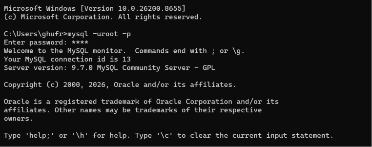

## Menambahkan Database
- Code

    ```create database nama_database;``` menambahkan database

    ```show databases;``` menampilkan database

- Contoh

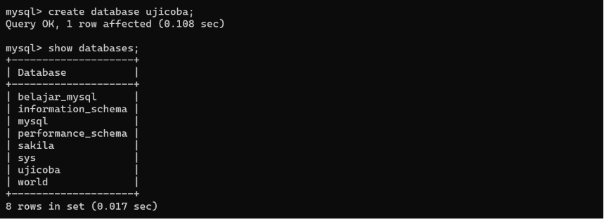

## Menghapus Database
- Code

    ```drop database nama_database;``` menghapus database

    ```show databases;``` menampilkan database

- Contoh

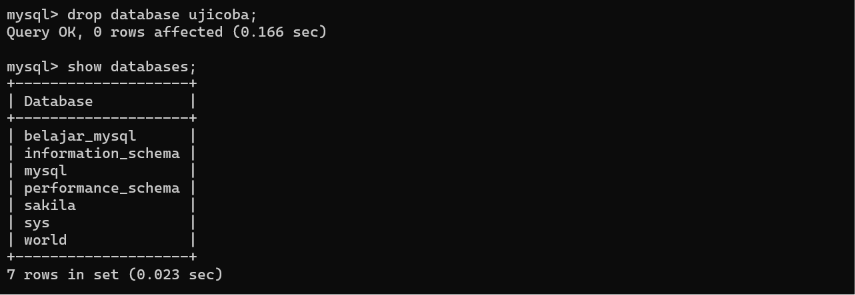

## Menmpilkan Daftar Storage Engine
- Code

    ```show engines;``` menampilkan daftar storage engine

- Contoh

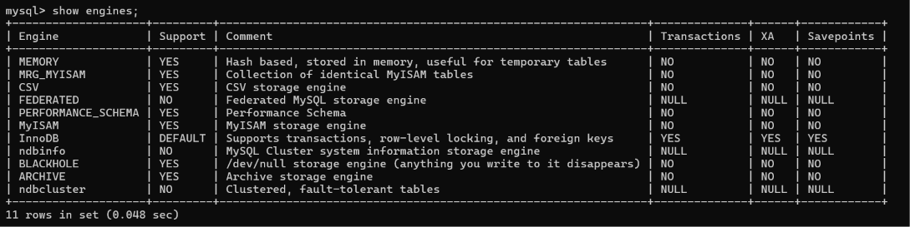

## Menambahkan Tabel
- Code

    ```use nama_database;``` **WAJIB** masuk ke dalam database yang ingin digunakan, 

  lalu masukan nama, dan isi tabel yang dibutuhkan
    ```
       create table nama_tabel( 
       id INT,
       nama VARCHAR(100), 
       harga INT,
       jumlah INT
       )engine = innodb;
    ```
- Contoh

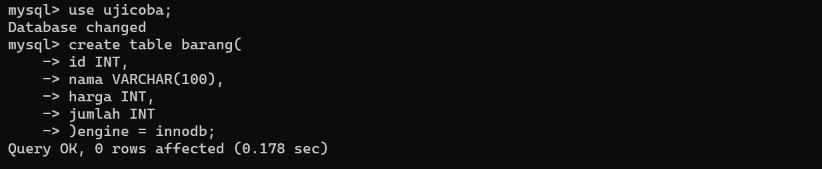

## Menaampilkan Tabel
- Code

    ```show tables;``` (inget! sebelumnya lo udah masukin *use nama_database*) jadi, code ini hanya menampilkan tabel pada database yang lo gunakan.

- Contoh

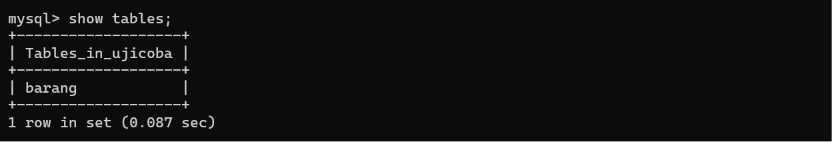

## Menampilkan Isi Tabel
- Code

    ```describe barang;``` (gue ingetin lagi, sebelumnya lo udah masukin *use nama_database*) jadi, code ini hanya menampilkan **isi** tabel pada database yang lo gunakan.

- Contoh

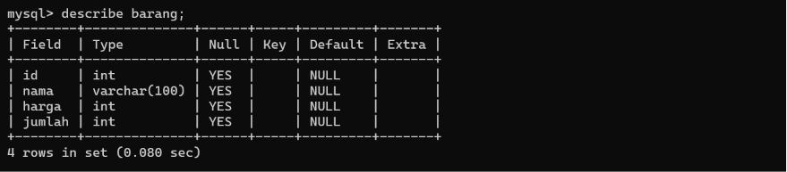

## Menampilkan Code Pembuatan Tabel
- Code

    ```show create tabel barang;``` buat liat sintak yang dipake saat membuat tabel.

- Contoh

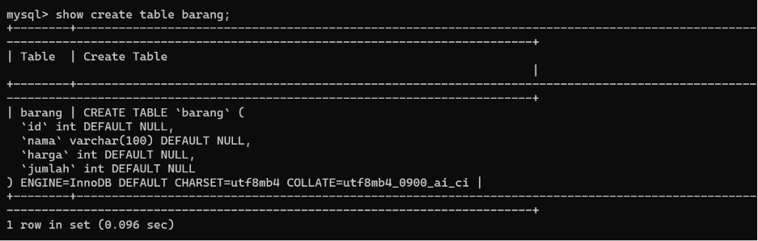

## Menambahkan Kolom Pada Tabel
- Code
    
    menambahkan kolom pada tabel
    ```
       alter table barang
       add column deksripsi text; 
    ```
    ```describe barang``` kalo code ini udah dibahas sebelumnya, harunsya lo udah ngerti
  
- Contoh

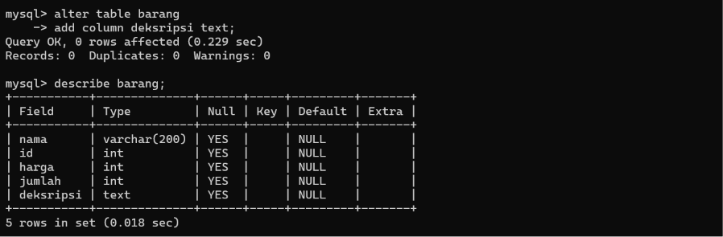

## Merubah Nama Pada Kolom Tabel
- Code
    
    merubah nama kolom yang udah ada sebelumnya.
    ```
       alter table barang
       rename column nama_kolom_sekarang to nama_kolom_baru; 
    ```
    ```describe barang``` kaya biasa.
  
- Contoh
  
perhatikan code **deksripsi to deskripsi**  
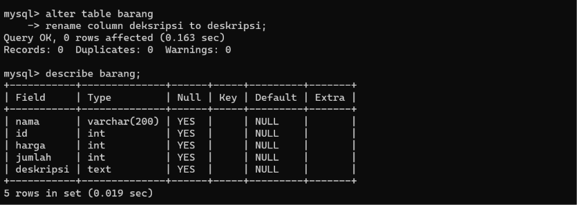

## [1] Mengedit Isi Tabel 
- Code
    
    biar gak puyeng gue isi code berdasarkan contoh. Fungsinya Ngubah type dan urutan pada kolom *nama* menjadi setelah *deskripsi*. (Bandingkan contoh dengan *Merubah Nama Pada Kolom Tabel*)
    ```
       alter table barang
       modify nama varchar(200) after deskripsi; 
    ```
    ```describe barang``` kaya biasa.
  
- Contoh
    
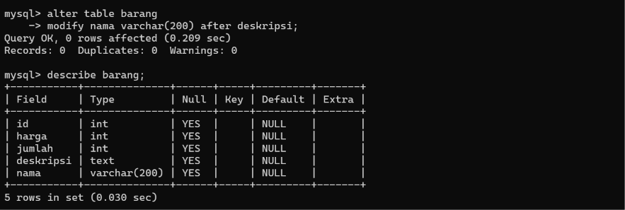

## [2] Mengedit Isi Tabel
- Code
    
    HANYA Mengubah urutan pada kolom *nama* menjadi urutan pertama. (Bandingkan contoh dengan *Mengedit Isi Tabel 1*)
    ```
       alter table barang
       modify nama varchar(200) after first; 
    ```
    ```describe barang``` kaya biasa.
  
- Contoh
    
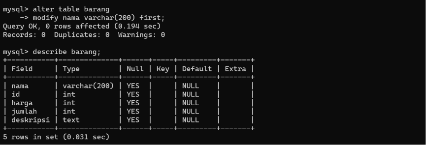

## Menghapus Isi Tabel
- Code
    
    Menghapus kolom *deskripsi*
    ```
       alter table barang
       drop column deskripsi; 
    ```
    ```describe barang``` kaya biasa.
  
- Contoh
    
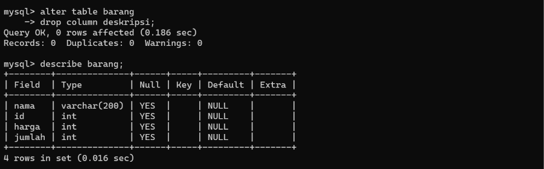

## Merubah Nilai Null 
- Code
 
    Mengubah nilai null menjadi not null pada kolom *id*
    ```
       alter table barang
       modify id int not null; 
    ```
    ```describe barang``` kaya biasa.
  
- Contoh

Jika nilai null pada data *id* tidak di isi maka datanya akan ditolak    
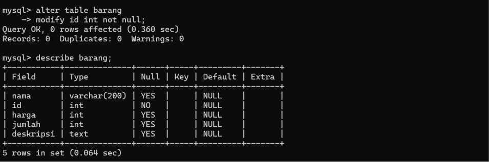

## Merubah Nilai Null dan Default 
- Code
  
    Mengubah nilai Null menjadi not null dan mengubah nilai Default menjadi 0 pada kolom *jumlah*
    ```
       alter table barang
       modify jumlah int not null default 0; 
    ```
    ```describe barang``` kaya biasa.
  
- Contoh

Jika data Default pada kolom *jumlah* tidak di isi maka datanya akan 0    
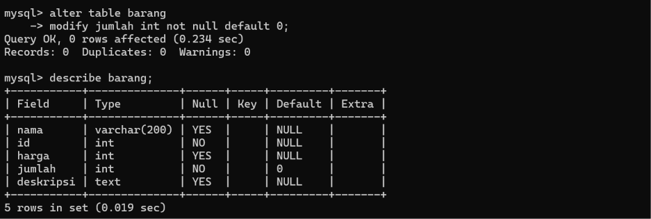

## Fungsi Timestamp Pada Default
- Code
  
    Menambahkan kolom *waktu_dibuat* dengan nilai default current_timestamp
    ```
       alter table barang
       add waktu_dibuat timestamp not null default current_timestamp; 
    ```
    ```describe barang``` kaya biasa.
  
- Contoh

jika nilai default pada kolom *waktu_dibuat* tidak di isi, maka data akan terisi otomatis sesuai waktu anda.    
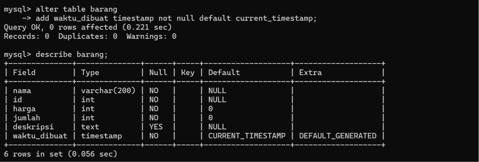

## Mengisi Data Pada Tabel
- Code
  
    Mengisi data pada kolom *id* dan *nama*

  ```insert into barang (id, nama) values (1, "Apel");```

    Menampilkan semua data pada tabel *barang* (untuk menampilkan kolom terpilih saja ada di bawah)

  ```select * from barang```
  
- Contoh

Sengaja cuma ngisi kolom *id* dan *nama* biar bisa liat data pada kolom *harga*, *jumlah*, *deskripsi*, dan *waktu_dibuat* yang terisi otomatis karena sebelumnya sudah kita edit nilainya   
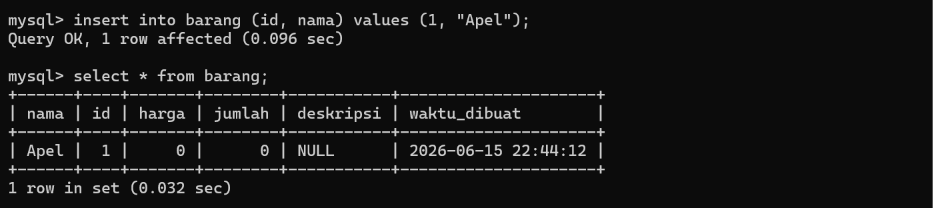

## Menghapus Data Pada Tabel
- Code
  
    Menghapus data pada tabel barang

  ```truncate barang;```

    Menampilkan semua data pada tabel *barang*

  ```select * from barang```
  
- Contoh

Code diatas hanya mengapus data pada tabel barang, Terlihat pada gambar jika data pada tabel sudah Empty.
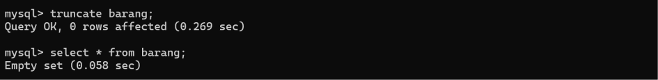

## Membuat Tabel Baru (Kolom Lebih Banyak Dikit)
- Code

  ```
     create table products
     (
     id               varchar(10) not null,
     name             varchar(100) not null,
     description      text,
     price            int unsigned not null,
     quantity         int unsigned not null default 0,
     created_at       timestamp not null default current_timestamp
     )
     engine = innodb;
  ```
  
- Contoh

Kali ini tabel yang dibuat lebih banyak bro.
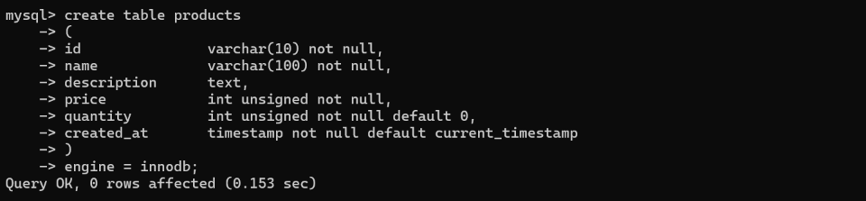

## [1] Mengisi Data Pada Tabel 
- Code

     Mengisi data *id, name, price, quantity* pada tabel *products*
  ```
     insert into products(id, name, price, quantity)
     values ("01", "Mie Ayam Original", 10000, 2);
  ```

     Menampilkan semua data pada tabel *products*
  ```
     select * from products;
  ```
  
- Contoh
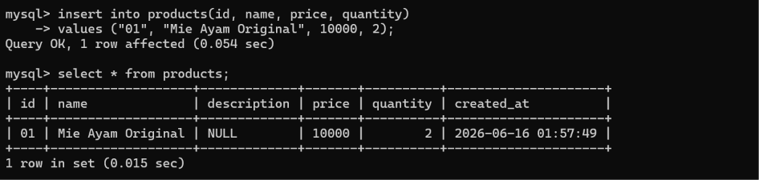

## [2] Mengisi Data Pada Tabel
- Code

     Mengisi data *id, name, description, price, quantity* pada tabel *products*
  ```
     insert into products(id, name, description, price, quantity)
     values ("01", "Mie Ayam Bakso", "Ayamnya masih hiduo", 15000, 2);
  ```

     Menampilkan semua data pada tabel *products*
  ```
     select * from products;
  ```
  
- Contoh
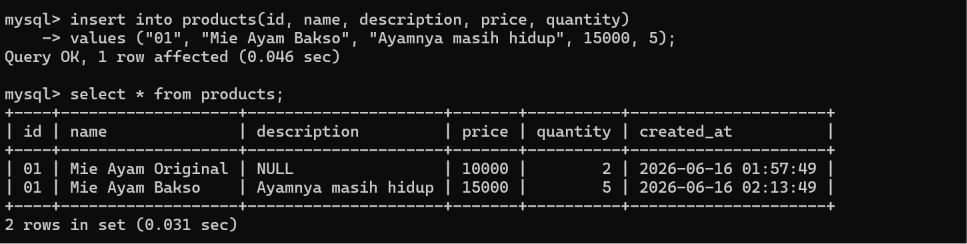

## [3] Mengisi Data Pada Tabel Banyak
- Code

     Mengisi data *id, name, price, quantity* pada tabel *products* langsung banyak.
  ```
     insert into products(id, name, price, quantity)
     values ("03", "Mie Ayam Yamin", 15000, 10),
            ("04", "Mie Ayam Spesial", 15000, 5),
            ("05", "Mie Ayam Pangsit", 12000, 1),
            ("06", "Mie Ayam Baso Urat", 20000, 20),
            ("07", "Mie Ayam Kuli", 20000, 15);
  ```

     Menampilkan semua data pada tabel *products*
  ```
     select * from products;
  ```
  
- Contoh
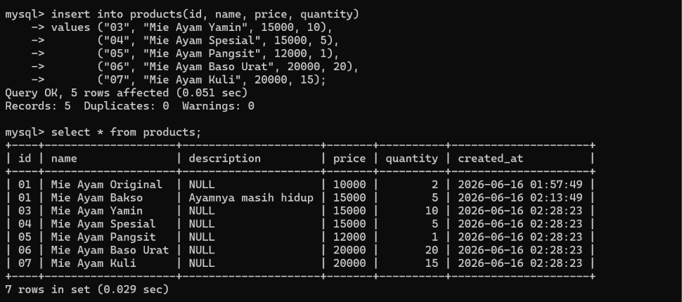

## [3] Menampilkan Data Terpilih Saja Pada Tabel
Sebelumnya gue selalu buat code untuk **Menampilkan semua data pada tabel**, kali ini berhubung datanya udah banyak gue akan buat code untuk **Menampilkan data yang dipilih aja**

- Code

      Menampilkan data *name, quantity, id* pada tabel *products*
  ```
     select name, quantity, id from products;
  ```
  
- Contoh

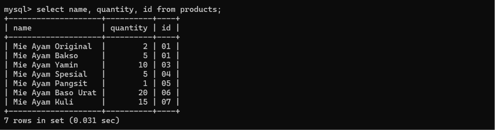

NEXT ISI DATA SEBANYAK-BANYAKNYA UNTUK PRAKTIK LEBIH DALAM YAA BROWWW
